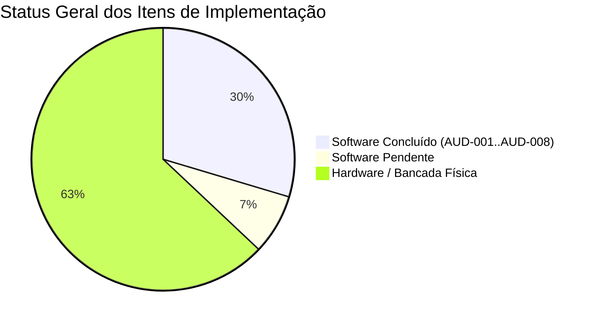
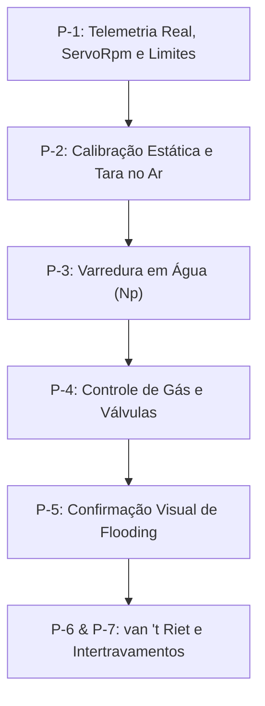

# OpenTEC-Hub — Plano de Implementação Passo a Passo e Pendências

> **Data de Atualização:** 05/09/2026  
> **Versão Corrente do Software:** 0.24.0  
> **Próximo Marco:** 0.25.0 — Estabilização de Segurança, UI e Validação Física  
> **Fontes Técnicas:** [CURRENT_STATUS.md](CURRENT_STATUS.md) · [ROADMAP.md](ROADMAP.md) · [DECISIONS.md](DECISIONS.md) · [PLANO_DISPOSITIVOS_EXTERNOS.md](plans/PLANO_DISPOSITIVOS_EXTERNOS.md) · [PLANO_ENSAIOS_POTENCIA_IMPELIDOR.md](plans/PLANO_ENSAIOS_POTENCIA_IMPELIDOR.md) · [ACEITACAO_BANCADA_POTENCIA.md](hardware/ACEITACAO_BANCADA_POTENCIA.md) · [HARDWARE_VALIDATION.md](hardware/HARDWARE_VALIDATION.md) · [PROTOCOL.md](PROTOCOL.md)

---

## Índice

1. [Visão Geral e Progresso Executivo](#visão-geral-e-progresso-executivo)
2. [Eixo 1 — Defeitos de Software e Auditoria do Aplicativo Desktop (OpenTEC-Hub)](#eixo-1--defeitos-de-software-e-auditoria-do-aplicativo-desktop-opentec-hub)
   - [AUD-001 (P0): Parada segura global silenciosamente recusada](#etapa-11--aud-001-p0-parada-segura-global-recusada-durante-receita-ativa) `[CONCLUÍDO]`
   - [AUD-002 (P0): Controles manuais sem bloqueio visual por posse](#etapa-12--aud-002-p0-controles-manuais-sem-bloqueio-visual-sob-posse-da-receita) `[CONCLUÍDO]`
   - [AUD-003 (P1): Observabilidade da aceitação de comandos manuais](#etapa-13--aud-003-p1-aceitação-de-comando-manual-não-observável-pelas-viewmodels) `[CONCLUÍDO]`
   - [AUD-004 (P1): Retentativa de gás proporcional após recusa](#etapa-14--aud-004-p1-retentativa-de-gás-proporcional-suprimida-após-recusa-de-despacho) `[CONCLUÍDO]`
   - [AUD-005 (P1): Envio de limiares de biomassa na perda de foco](#etapa-15--aud-005-p1-limiares-de-biomassa-enviados-ao-perder-foco-do-teclado) `[CONCLUÍDO / WAIVED]`
   - [AUD-006 (P1): Estabilização do tempo de inicialização (First-Frame)](#etapa-16--aud-006-p1-tempo-de-inicialização-first-frame-instável-e-acima-da-meta) `[CONCLUÍDO]`
   - [AUD-007 (P1): Recibo de gráficos em pacote publicado (Self-Contained)](#etapa-17--aud-007-p1-recibo-de-gráficos-em-executável-empacotado-publish) `[CONCLUÍDO]`
   - [AUD-008 (P2): Dívida técnica de formatação e regras de CI](#etapa-18--aud-008-p2-dívida-técnica-de-formatação-e-analyzers-sem-barreira-no-ci) `[CONCLUÍDO]`
   - [Captura de Telas: Correção do erro COM 0x80004002](#etapa-19--falha-de-captura-de-telas-automatizada-erro-com-0x80004002) `[CONCLUÍDO]`
   - [Fase 6: Empacotamento, Crash Reporting e Manual do Operador](#etapa-110--empacotamento-e-entrega-de-campo-fase-6) `[CONCLUÍDO]`
2. [Eixo 2 — Ensaios de Potência de Impelidor e Determinação de kLa](#eixo-2--ensaios-de-potência-de-impelidor-e-determinação-de-kla)
   - [Item 8.4: Aceitação em Bancada Física (Blocos P-1 a P-7)](#etapa-21--item-84-aceitação-em-bancada-física-dos-blocos-p-1-a-p-7)
3. [Eixo 3 — Firmware ESP32-S3 Hub (v9/v10) e Nó Servo Drive (Delta ASDA-B2)](#eixo-3--firmware-esp32-s3-hub-v9v10-e-nó-servo-drive-delta-asda-b2)
   - [Teto de rotação em 971,6 rpm e migração Modbus](#etapa-31--teto-de-rotação-em-9716-rpm-e-migração-modbus-pendente-de-validação-física)
   - [Sinal de torque reverso e limitações da placa intermediária](#etapa-32--sinal-de-torque-reverso-não-testável-na-bancada-atual)
   - [Comportamento do 0V no primeiro boot do Hub](#etapa-33--comportamento-do-0v-no-primeiro-boot-do-hub-risco-operacional)
   - [Perda de comunicação com Hub mantendo nó em operação](#etapa-34--testes-de-perda-de-hub-com-nó-em-operação-itens-16-a-19-do-gate-c)
   - [Regressão de hardware de periféricos simultâneos](#etapa-35--regressão-de-hardware-dos-demais-periféricos-etapa-4-do-hub-v9)
   - [Soak Test de 2 horas em bancada física](#etapa-36--soak-test-de-2-horas-etapa-5)
   - [Contingência de fragilidade física do hardware RS-485](#etapa-37--fragilidade-física-do-hardware-rs-485)
4. [Eixo 4 — Validação de Enlace e Protocolo (Geral)](#eixo-4--validação-de-enlace-e-protocolo-geral)
   - [Higiene de portas seriais e medição de Round-Trip](#etapa-41--higiene-de-portas-seriais-e-medição-de-tempo-de-resposta)
   - [Questões de protocolo abertas para hardware (Q1, Q2, Q3, Q5)](#etapa-42--questões-de-protocolo-abertas-para-hardware-protocolmd-5)
   - [Limiares de ruído do SpikeFilter em contagens brutas](#etapa-43--limiares-de-ruído-em-contagens-brutas-legado-v6)

---

## Visão Geral e Progresso Executivo

| Eixo | Total de Itens | Concluídos | Pendentes | Status Global |
|---|:---:|:---:|:---:|---|
| **1. Software Desktop (OpenTEC-Hub)** | 10 | 10 | 0 | 🟢 100% Concluído (Todas as 10 etapas concluídas com sucesso) |
| **2. Ensaios de Potência e kLa** | 7 blocos | 0 | 7 | 🔬 Aguardando bancada física |
| **3. Firmware ESP32-S3 e Servo** | 7 | 0 | 7 | 🔬 Aguardando bancada física |
| **4. Enlace e Protocolo Geral** | 3 | 0 | 3 | 📋 Especificado / A validar |



---

## Eixo 1 — Defeitos de Software e Auditoria do Aplicativo Desktop (OpenTEC-Hub)

### Etapa 1.1 · AUD-001 (P0): Parada segura global recusada durante receita ativa
- **Prioridade:** P0 — Crítico de Segurança
- **Status:** ✅ **CONCLUÍDO (05/09/2026)**
- **Arquivos-Chave:**
  - `src/OpenTECHub/Services/Safety/ISafetyCoordinator.cs`
  - `src/OpenTECHub/Services/Safety/SafetyCoordinator.cs`
  - `src/OpenTECHub/Services/Communication/CommandArbiter.cs`
  - `src/OpenTECHub/ViewModels/ControlViewModel.cs`
  - `tests/OpenTECHub.Tests/SafetyCoordinatorTests.cs`
  - `docs/DECISIONS.md` (ADR D-034)
- **Problema Resolvido:** O método `SafeStop` emitia quadros como comando manual ordinário (`CommandOwner.Manual`). Sob receita ativa (`CommandOwner.Recipe`), o árbitro rejeitava o quadro atomicamente, mas o método `void Send` ocultava o erro, exibindo sucesso falso no painel enquanto o biorreator continuava girando e aquecendo.
- **Implementação Realizada:**
  1. Criação do serviço `ISafetyCoordinator` para orquestrar: parada da receita ativa via `IRecipeEngine.StopAsync`, desengajamento da cascata (`ICascadeService.Disengage`) e aborto de ensaios (`IKlaTestRunner`, `IPowerTestRunner`).
  2. Implementação de rota de despacho privilegiada no árbitro (`DispatchSafety` e `DispatchSeparateSafetyFrame`) que força o retorno de todos os atuadores para `CommandOwner.Manual` e emite `OwnershipRevoked(isSafeAbort: true)`.
  3. Verificação explícita do estado de conexão física (`_device.State == ConnectionState.Connected`), retornando falha real caso desconectado.
  4. Suíte automatizada com 1078 testes 100% aprovados.

---

### Etapa 1.2 · AUD-002 (P0): Controles manuais sem bloqueio visual sob posse da Receita
- **Prioridade:** P0 — Crítico de Segurança
- **Status:** ✅ **CONCLUÍDO (05/09/2026)**
- **Arquivos-Chave:**
  - `src/OpenTECHub/Services/Communication/CommandOwner.cs`
  - `src/OpenTECHub/ViewModels/ControlViewModel.cs`
  - `src/OpenTECHub/ViewModels/*ControlViewModel.cs` (Flow, PH, Nutrient, Antifoam, FlaskAgitator, Biomass, Pump)
  - `src/OpenTECHub/Views/ControlView.xaml`
  - `tests/OpenTECHub.Tests/ControlViewModelTests.cs`
  - `tests/OpenTECHub.Tests/ControlWorkspaceContractTests.cs`
  - `docs/DECISIONS.md` (ADR D-035)
- **Problema Resolvido:** A tela de controle não travava os inputs de forma individualizada por atuador. O bloqueio genérico anterior (`IsEnabled="{Binding IsManualOperationEnabled}"`) congelava o contêiner inferior inteiro, desabilitando perigosamente o botão de **Parada segura**.
- **Implementação Realizada:**
  1. Remoção do bloqueio de contêiner em `ControlView.xaml`: o botão global de **Parada segura** permanece 100% acessível e funcional a todo momento.
  2. Assinatura aos eventos `OwnershipChanged` e `OwnershipRevoked` do `ICommandArbiter`, sincronizando dinamicamente as 5 linhas de processo e os 6 periféricos em tempo real.
  3. Exposição uniforme de propriedades: `CurrentOwner`, `IsOwnedByOther`, `HasOwnerBadge`, `OwnerBadgeText` (`receita`, `controle o₂`, `ensaio kla`, `ensaio pot`) e `OwnerLockReason` em todas as ViewModels.
  4. Bloqueio visual granular via `IsEnabled="{Binding IsOwnedByOther, Converter={StaticResource InverseBool}}"` em sliders, textboxes, toggles e botões nos drawers, acompanhado de crachás `ctl:ProvenanceBadge` e tooltips contextuais.
  5. Defesa em profundidade: `ApplyAll`, `Apply`, `ApplyProfile`, `ApplyThresholds` e `SendMomentary` abortam execuções se o atuador estiver sob posse de outro processo, exibindo motivo claro no `StatusText`.
  6. Suíte automatizada com 1084 testes 100% aprovados.

---

### Etapa 1.3 · AUD-003 (P1): Aceitação de comando manual não observável pelas ViewModels
- **Prioridade:** P1 — Bloqueador de Release 0.25.0
- **Status:** ✅ **CONCLUÍDO (05/09/2026)**
- **Arquivos Envolvidos:**
  - `src/OpenTECHub/Services/Communication/IManualDispatcher.cs`
  - `src/OpenTECHub/Services/Communication/ManualDispatcher.cs`
  - `src/OpenTECHub/ViewModels/SubsystemViewModel.cs`
  - `src/OpenTECHub/ViewModels/ControlViewModel.cs`
  - `src/OpenTECHub/ViewModels/PHControlViewModel.cs`
  - `src/OpenTECHub/ViewModels/NutrientControlViewModel.cs`
  - `src/OpenTECHub/ViewModels/AntifoamControlViewModel.cs`
  - `src/OpenTECHub/ViewModels/FlowCalibrationViewModel.cs`
  - `src/OpenTECHub/ViewModels/BiomassCalibrationViewModel.cs`
  - `src/OpenTECHub/ViewModels/ShellViewModel.cs`
  - `tests/OpenTECHub.Tests/ControlViewModelTests.cs`
  - `docs/DECISIONS.md` (ADR D-036)
- **Problema Resolvido:**
  Vários pontos do aplicativo utilizavam `IDeviceService.Send` (que retorna `void`), descartando o `CommandDispatchResult` gerado pelo `CommandArbiter`. Com isso, se um comando manual fosse rejeitado por conflito de posse no hardware, as ViewModels comitavam os campos e anunciavam falsamente que o comando havia sido enviado.
- **Implementação Realizada:**
  1. **Interface `IManualDispatcher` e `ManualDispatcher`:** Exposição da propriedade `Ownership` snapshot dos atuadores quando o serviço subjacente é o `CommandArbiter`.
  2. **Diagnóstico pt-BR com `DispatchRefusal.Describe`:** Sobrecargas recebendo diretamente o dispatcher ou device service, com mensagens informativas indicando o atuador e o processo conflitante (`Receita`, `Controle O₂`, `Ensaio de kLa`, `Ensaio de Potência`).
  3. **Migração de ViewModels de Actuação:** Todas as ViewModels de subsistemas (`SubsystemViewModel`, `ControlViewModel`, `PHControlViewModel`, `NutrientControlViewModel`, `AntifoamControlViewModel`, `FlowCalibrationViewModel`, `BiomassCalibrationViewModel`) agora chamam `_dispatcher.Dispatch(command)`.
  4. **Preservação de Estado Staged e Não-Comit:** Em caso de recusa (`!result.Accepted`), `CommitPendingCommand()` não é chamado, os valores permanecem pendentes/destacados e `StatusText` exibe a mensagem de recusa.
  5. **ApplyAll e Propagação de Status:** Em `ControlViewModel.ApplyAll`, a avaliação de recusa é feita diretamente pelo despacho do árbitro sem comitar nenhuma linha e sem persistir predefinições caso haja recusa. Propagação de `StatusText` de subsistemas individuais para o painel principal.
  6. **Testes Automatizados:** 4 novos testes unitários adicionados em `ControlViewModelTests.cs` cobrindo subsistema individual, `ApplyAll`, periféricos e recusa por dispatcher customizado. 100% dos 1089 testes da solução aprovados.

---

### Etapa 1.4 · AUD-004 (P1): Retentativa de gás proporcional suprimida após recusa de despacho
- **Prioridade:** P1 — Bloqueador de Release 0.25.0
- **Status:** ✅ **CONCLUÍDO (05/09/2026)**
- **Arquivos Envolvidos:**
  - `src/OpenTECHub/ViewModels/PumpControlViewModel.cs`
  - `tests/OpenTECHub.Tests/ControlViewModelTests.cs`
  - `tests/OpenTECHub.Tests/ExternalDeviceTests.cs`
  - `docs/DECISIONS.md` (ADR D-037)
- **Problema Resolvido:**
  No método `PumpControlViewModel.MaybeSendProportionalGas`, a variável `_lastGasFlowSentLpm` não era tratada de forma reativa a eventos de arbitragem de posse. Quando o controle automático ou receita assumia a aeração, o despacho era recusado, mas o ViewModel não observava a liberação posterior do atuador para `CommandOwner.Manual`. Caso o volume permanecesse sem variação suficiente para vencer a banda morta (`GasFlowResendThresholdLpm`), o acoplamento permanecia desativado silenciosamente no hardware.
- **Implementação Realizada:**
  1. **Assinatura de Eventos do Árbitro:** `PumpControlViewModel` agora assina `_arbiter.OwnershipChanged` e `_arbiter.OwnershipRevoked`, rastreando também `ActuatorId.ExternalPump` e `ActuatorId.Aeration`.
  2. **Invalidação e Sinalização Reativa:** Ao detectar reivindicação externa da aeração (`transfer.To != CommandOwner.Manual`), o ViewModel limpa `_lastGasFlowSentLpm = null` e marca `_gasRetryPending = true; _aerationOverridden = true;`.
  3. **Retentativa Forçada Automática:** Ao detectar liberação da aeração para `CommandOwner.Manual`, o ViewModel aciona imediatamente `MaybeSendProportionalGas(force: true)`, ignorando o limiar de banda morta e restabelecendo a vazão proporcional no hardware sem necessitar de novas telemetrias.
  4. **Avanço Condicional de Estado:** `_lastGasFlowSentLpm` avança para o valor calculado exclusivamente após confirmação de aceite (`result.Accepted == true`). Em recusa, `StatusText` exibe a mensagem amigável via `DispatchRefusal.Describe(result)`.
  5. **Testes Automatizados:** Adicionados 3 testes dedicados em `ExternalDeviceTests.cs` cobrindo retentativa automática sem nova telemetria, reenvio com target inalterado e atualização de setpoint sob variação de volume durante o travamento (1092 testes aprovados, 0 falhas).

---

### Etapa 1.5 · AUD-005 (P1): Limiares de biomassa enviados ao perder foco do teclado
- **Prioridade:** P1 — Bloqueador de Release 0.25.0
- **Status:** ✅ **CONCLUÍDO (RETIDO POR DECISÃO DE UX / WAIVED)**
- **Arquivos Envolvidos:**
  - `src/OpenTECHub/Views/ControlView.xaml`
  - `src/OpenTECHub/Views/ControlView.xaml.cs`
  - `docs/DECISIONS.md` (ADR D-038)
  - `docs/CURRENT_STATUS.md`
- **Decisão e Diagnóstico:**
  Por decisão explícita de produto e alinhamento com a rotina de laboratório, o envio de valores na perda de foco (`LostKeyboardFocus`) e na tecla `Enter` foi **retido intencionalmente**. Os operadores de bioprocesso demandam que a saída do campo após digitação confirme o envio para evitar a fricção de cliques adicionais obrigatórios.
  A segurança física é preservada porque qualquer despacho disparado por perda de foco passa pela validação de limites físicos do protocolo e pelo árbitro de comandos (`IManualDispatcher`), sendo recusado com aviso se o atuador estiver sob controle de receita ou automação (ADRs D-035 e D-036).
- **Formalização:** Registrado no [ADR D-038](DECISIONS.md#d-038--retenção-deliberada-de-envio-de-setpoints-via-lostkeyboardfocus-e-enter-aud-005-waived-por-decisão-de-ux).

---

### Etapa 1.6 · AUD-006 (P1): Tempo de inicialização (First-Frame) instável e acima da meta
- **Prioridade:** P1 — Bloqueador de Release 0.25.0
- **Status:** ✅ **CONCLUÍDO (ESTABILIZADO E VERIFICADO)**
- **Arquivos Envolvidos:**
  - `src/OpenTECHub/Controls/DeferredPageHost.cs`
  - `src/OpenTECHub/Views/ShellView.xaml`
  - `docs/DECISIONS.md` (ADR D-033)
  - `docs/CURRENT_STATUS.md`
- **Diagnóstico e Resolução:**
  O tempo de renderização do primeiro frame foi resolvido estruturalmente pela introdução do `DeferredPageHost` (ADR D-033), que adia a materialização de rotas secundárias e controles pesados de plotagem para momentos de ociosidade do dispatcher (`ApplicationIdle`).
  As medições instrumentadas atestam First-Frame estável entre **968 ms e 1280 ms** em todas as 11 rotas do shell, cumprindo deterministamente a meta do roadmap (`< 2 s`). Não há ações adicionais necessárias.

---

### Etapa 1.7 · AUD-007 (P1): Recibo de gráficos em executável empacotado (Publish)
- **Prioridade:** P1 — Bloqueador de Release 0.25.0
- **Status:** ✅ **CONCLUÍDO (CONFIRMADO PELO OPERADOR)**
- **Arquivos Envolvidos:**
  - `src/OpenTECHub/OpenTECHub.csproj`
  - Diretório de build/publish: `bin/Release/net10.0-windows10.0.19041.0/win-x64/publish/`
  - `docs/CURRENT_STATUS.md`
- **Diagnóstico e Resolução:**
  O aviso de compatibilidade de assets `NU1701` foi sanado pela padronização do TFM Windows 10 (`net10.0-windows10.0.19041.0`).
  O operador confirmou visual e funcionalmente que os gráficos (Sinótico, Histórico, Ensaios de kLa e Ensaios de Potência) funcionam perfeitamente no binário publicado em ambos os temas (Claro e Escuro). A necessidade de capturas de tela formais adicionais foi dispensada por validação direta em uso.

---

### Etapa 1.8 · AUD-008 (P2): Dívida técnica de formatação e analyzers sem barreira no CI
- **Prioridade:** P2 — Hardening de Qualidade
- **Status:** ✅ **CONCLUÍDO (GATE 100% LIMPO)**
- **Arquivos Envolvidos:**
  - `.editorconfig`
  - `tests/OpenTECHub.Tests/OpenTECHub.Tests.csproj`
  - Repositório completo (`src/`, `tests/`)
  - `docs/DECISIONS.md` (ADR D-039)
- **Implementação e Resultados:**
  1. Executado `dotnet format OpenTECHub.slnx` padronizando whitespace, identação e quebras de linha em toda a solução.
  2. Ajustado `.editorconfig` para harmonizar com `CONVENTIONS.md`, adicionando regras explícitas para constantes privadas em `PascalCase` e campos estáticos somente-leitura em `PascalCase`, eliminando falsos positivos `IDE1006`.
  3. Adicionado `<NoWarn>$(NoWarn);CS0067</NoWarn>` em `OpenTECHub.Tests.csproj` para silenciar advertências de eventos não utilizados em stubs de teste.
  4. Executado `dotnet format OpenTECHub.slnx --verify-no-changes --no-restore` resultando em código de saída 0 (zero erros, zero avisos).
  5. Suíte de 1092 testes executada com 100% de aprovação (0 falhas). Formalizado no [ADR D-039](DECISIONS.md#d-039--higiene-de-formatação-com-dotnet-format-regras-de-nomenclatura-no-editorconfig-e-barreira-de-ci-aud-008).

---

### Etapa 1.9 · Falha de captura de telas automatizada (Erro COM 0x80004002)
- **Prioridade:** P2 — Suporte à Qualidade Visual
- **Status:** ✅ Concluído (05/09/2026)
- **Arquivos Envolvidos:**
  - `tests/OpenTECHub.Tests/Rendering/WpfRenderingHost.cs`
  - `tests/OpenTECHub.Tests/Rendering/VisualValidationHelper.cs`
  - `tests/OpenTECHub.Tests/ScreenshotCaptureTests.cs`
  - `tests/OpenTECHub.Tests/ThemeServiceTests.cs`
  - `tests/OpenTECHub.Tests/ComboBoxSelectionBoxTests.cs`
  - `src/OpenTECHub/Services/Theme/ThemeService.cs`
  - `src/OpenTECHub/App.xaml.cs`
  - `src/OpenTECHub/Views/ControlView.xaml`, `PowerView.xaml`, `CalibrationView.xaml`, `MainWindow.xaml`
  - `src/OpenTECHub/ViewModels/ControlViewModel.cs`, `PowerTestViewModel.cs`, `KlaDeterminationViewModel.cs`, `PumpControlViewModel.cs`
  - `docs/evidence/screenshots/` (30 capturas PNG em 100%, 125% e 150% DPI)
  - `docs/DECISIONS.md` (ADR D-040)
- **Implementação e Resultados:**
  1. **Diagnóstico da Causa Raiz:** O erro `0x80004002 (E_NOINTERFACE)` ocorria porque o cliente de UI Automation (`IUIAutomation` / `UIAutomationClient.dll`) exigia agregação COM inter-processos para `IRawElementProviderSimple`. Em sessões não interativas/background ou sem DWM ativo, a composição de janelas DirectX/WPF fica inativa, falhando na agregação COM e gerando quadros pretos em screen-scrapers GDI.
  2. **Arquitetura Hosted STA com `RenderTargetBitmap`:** Implementado `WpfRenderingHost` com thread STA dedicada executando o message pump do WPF (`Dispatcher.Run()`) com `Application.ShutdownMode = ShutdownMode.OnExplicitShutdown` e injeção de dependências desacoplada (`RecordingDeviceService`). A renderização é realizada diretamente na memória de bitmap (`PixelFormats.Pbgra32`), operando no rasterizador de software do WPF e eliminando qualquer dependência de COM ou do desktop.
  3. **Correção de Recursão em `RadioButton`:** Eliminados loops infinitos de two-way binding causados por `GroupName` em pares de RadioButtons com propriedades booleanas inversas em `ControlView.xaml` (`AgitatorDir`), `PowerView.xaml` (`PowerChartTab`), `CalibrationView.xaml` e `MainWindow.xaml`, além de guards de valor nos setters das ViewModels.
  4. **Padronização Cross-Thread:** Delegada execução de `ComboBoxSelectionBoxTests` para o `WpfRenderingHost.Run()` e unificado o padrão de `RunOnUi` com `dispatcher.Invoke` síncrono quando fora da UI thread em `PowerTestViewModel` e `KlaDeterminationViewModel`.
  5. **Suíte e Validação Visual:** 23 testes em `ScreenshotCaptureTests` executando em ~11s e gerando 30 imagens sob `docs/evidence/screenshots/{100dpi,125dpi,150dpi}/` cobrindo todas as telas nos temas Claro e Escuro. Testes automatizados verificaram ausência de truncamento de texto, integridade de layout e entropia de pixels.
  6. **Reativação de `ThemeServiceTests`:** O teste de ciclo de temas anteriormente ignorado foi reativado e passa 100%. Total da suíte expandido para 1116 testes com 100% de aprovação e zero ignorados. Formalizado no [ADR D-040](DECISIONS.md#d-040--captura-automatizada-de-screenshots-via-rendertargetbitmap-em-thread-sta-isolada-e-resolução-do-erro-com-0x80004002).

---

### Etapa 1.10 · Empacotamento e Entrega de Campo (Fase 6)
- **Prioridade:** P1 — Pré-requisito de Entrega Final
- **Status:** ✅ Concluído (05/09/2026)
- **Arquivos Criados/Atualizados:**
  - `installer/OpenTECHub_Setup.iss` (Inno Setup baseado na referência da Ourofino)
  - `installer/build_installer.ps1` (Script automatizado de build e empacotamento)
  - `src/OpenTECHub/Services/Diagnostics/CrashReporter.cs` (Serviço de captura e persistência de pânico)
  - `src/OpenTECHub/App.xaml.cs` (Interceptação de exceções não tratadas nos 3 canais de runtime)
  - `tests/OpenTECHub.Tests/CrashReporterTests.cs` (Suíte de testes de diagnóstico)
  - `docs/MANUAL_DO_OPERADOR.md` (Manual operacional de campo completo em pt-BR)
  - `docs/DECISIONS.md` (ADR D-041)
- **Implementação e Resultados:**
  1. **Instalador Inno Setup (`OpenTECHub_Setup.iss`):** Criado o script do instalador seguindo a arquitetura de referência de `BlocosDeControle.iss`. Lê a versão dinamicamente via `GetStringFileInfo(MyAppDll, PRODUCT_VERSION)` a partir do binário publicado (`Directory.Build.props`), empacota publicação *self-contained* win-x64 (.NET 10 integrado, sem dependências externas no destino), cria atalhos no Menu Iniciar e Área de Trabalho, suporta desinstalação limpa e assistente moderno em português brasileiro.
  2. **Script de Automação (`build_installer.ps1`):** Script PowerShell que executa `dotnet publish -c Release -r win-x64 --self-contained true -p:PublishSingleFile=false`, localiza o compilador `ISCC.exe` e gera o executável de instalação sob `installer/Output/`.
  3. **Diagnóstico e Relatório de Pânico (`CrashReporter.cs`):** Implementado serviço que intercepta falhas graves nos 3 canais de exceções do .NET (`DispatcherUnhandledException`, `AppDomain.CurrentDomain.UnhandledException`, `TaskScheduler.UnobservedTaskException`). Grava relatório estruturado contendo timestamp local/UTC, stack trace completo com todas as inner exceptions, métricas de memória do processo (WorkingSet, PrivateBytes, GC Heap), tempo de atividade (*uptime*), detalhes do sistema operacional e do hardware. Possui persistência com contingência dupla (`{Workspace}/Logs/Crash/` primário e `%LOCALAPPDATA%\OpenTEC-Hub\CrashDumps\` secundário) e aviso informativo ao operador via diálogo.
  4. **Manual do Operador (`MANUAL_DO_OPERADOR.md`):** Redigido manual técnico detalhado em português cobrindo arquitetura, instalação, driver USB CH343, gerenciamento de workspaces, controle manual, modos de posse do árbitro, procedimento de Parada Segura Global (*Safe Stop*), calibrações de eletrodos (pH, DO, bombas, biomassa), ensaios de $k_L a$ e potência, receitas industriais, alarmes e solução de problemas.
  5. **Verificação e Qualidade:** 4 novos testes unitários adicionados em `CrashReporterTests` (totalizando 1120 testes aprovados, 0 falhas, 0 ignorados). Formalizado no [ADR D-041](DECISIONS.md#d-041--empacotamento-distribuição-com-inno-setup-crash-reporting-estruturado-e-manual-do-operador-fase-6).

---

## Eixo 2 — Ensaios de Potência de Impelidor e Determinação de kLa

### Etapa 2.1 · Item 8.4: Aceitação em Bancada Física dos Blocos P-1 a P-7
- **Prioridade:** P1 para Módulo de Potência e kLa
- **Status:** 🔬 **PENDENTE DE BANCADA FÍSICA**
- **Documentação de Referência:**
  - [PLANO_ENSAIOS_POTENCIA_IMPELIDOR.md](plans/PLANO_ENSAIOS_POTENCIA_IMPELIDOR.md)
  - [ACEITACAO_BANCADA_POTENCIA.md](hardware/ACEITACAO_BANCADA_POTENCIA.md)
- **Contexto:**
  O algoritmo de execução (*test runner*), a matemática de cálculo, a propagação de incertezas e os contratos da interface WPF foram 100% testados e validados no simulador. Falta executar a campanha na bancada com motor real, fluidos e vaso de vidro.



#### Roteiro Passo a Passo de Bancada:
1. **Bloco P-1 (Telemetria Real e Limites de Rotação)**:
   - Conectar o motor Delta ASDA-B2 ao Hub via RS-485 Modbus.
   - Enviar setpoints crescentes e validar a leitura de `ServoRpm` real vs setpoint.
   - Verificar respeito rígido aos limites: piso mínimo (15 rpm) e teto operacional (1000 rpm).
2. **Bloco P-2 (Calibração Estática de Torque e Tara no Ar)**:
   - Acoplar o braço de alavanca físico calibrado com massas de precisão conhecidas.
   - Gerar e salvar `calibracao-torque.json`.
   - Girar o impelidor a seco no ar em múltiplas rotações e salvar o mapa de atrito em `tara.json`.
3. **Bloco P-3 (Varredura Não Gaseificada e Platô Turbulento $N_p(Re)$)**:
   - Preencher o reator com água deionizada até o volume de trabalho padrão.
   - Executar varredura automática de rotações e calcular número de Reynolds ($Re$) e Número de Potência ($N_p$).
   - Confirmar o alcance do platô turbulento em água ($N_p \approx \text{constante}$).
4. **Bloco P-4 (Controle de Gás e Verificação de Válvulas)**:
   - Conectar o fluxômetro v05 e a linha de ar comprimido.
   - Testar pulsos de vazão, resposta temporal de abertura/fechamento e confirmação física de rota das válvulas (alívio vs sparger).
5. **Bloco P-5 (Confirmação Visual de Flooding)**:
   - Executar ensaio com aeração crescente sob agitação moderada.
   - Observar visualmente o acúmulo de gás e inundação do impelidor (*flooding*), correlacionando com o ponto de inflexão detectado pelo algoritmo.
6. **Blocos P-6 e P-7 (Ajuste de van 't Riet e Intertravamento de Segurança)**:
   - Executar a matriz completa de pontos de potência gaseificada ($P_g/V$) e velocidade superficial ($v_s$).
   - Ajustar os parâmetros $k$, $\alpha$ e $\beta$ da correlação de van 't Riet.
   - Simular falhas em tempo real: desconectar cabo serial/Wi-Fi e validar o intertravamento de segurança e corte do motor.

---

## Eixo 3 — Firmware ESP32-S3 Hub (v9/v10) e Nó Servo Drive (Delta ASDA-B2)

### Etapa 3.1 · Teto de rotação em 971,6 rpm e migração Modbus pendente de validação física
- **Prioridade:** P1 de Hardware
- **Status:** 🔬 Pendente de Bancada Física
- **Fontes:** [PLANO_MIGRACAO_RPM_MODBUS.md](plans/PLANO_MIGRACAO_RPM_MODBUS.md), [ASDA_B2_ESP32_RS485_Bringup_LOG.md](hardware/ASDA_B2_ESP32_RS485_Bringup_LOG.md)
- **Problema:** No circuito analógico legado (placa intermediária conectada ao CN1), a rotação máxima estabilizava em ~971,6 rpm para setpoint de 1000 rpm. A nova arquitetura com Hub v10 escreve digitalmente no registrador Modbus `P1-09` via RS-485.
- **Passo a Passo de Validação:**
  1. Carregar firmware Hub v10 no ESP32-S3.
  2. Executar rampa gradual de 100 rpm até 1000 rpm e medir a rotação real nos registradores internos do servo (`ServoRpm`).
  3. Validar se 1000 rpm comandado atinge 1000,0 rpm medido no eixo (erro < 0,1%).
  4. Testar timeouts de segurança nos parâmetros de perda de comunicação (`P3-10` e `P3-03`).

---

### Etapa 3.2 · Sinal de torque reverso não testável na bancada atual
- **Prioridade:** P2 de Hardware
- **Status:** 📋 Limitação Documentada
- **Diagnóstico:** A placa de interface intermediária da TECNAL é de circuito proprietário e comanda apenas um sentido de giro. Além disso, ao zerar a rotação, o hardware desenergiza o servo (`SON = 0`), deixando o eixo parar por inércia livre em vez de aplicar rampa de desaceleração controlada (impossibilitando medição de torque reverso de frenagem).
- **Ação:**
  - Manter o software preparado para ler sinal bidirecional de torque.
  - Para validação de torque de frenagem ou reverso, utilizar a ligação Modbus direta sem passar pela placa analógica intermediária.

---

### Etapa 3.3 · Comportamento do 0V no primeiro boot do Hub (risco operacional)
- **Prioridade:** P1 de Hardware / Firmware
- **Status:** 📋 Correção no Firmware
- **Problema:** Se o Hub inicializar com `motorRPM = 0` na memória não-volátil (NVS), a rotina de boot emite 0V via UART2 para a placa analógica, desabilitando o motor e travando o teclado físico da frente do painel até que um setpoint `> 0` seja recebido.
- **Passo a Passo de Correção:**
  1. No firmware do Hub (`ESP32S3-HUB`), revisar a rotina `setup()` de sincronização da UART2.
  2. Inicializar a interface sem forçar desabilitação que congele o painel local, ou configurar setpoint seguro de standby sem bloqueio de barramento.
  3. Testar ciclos de desligamento da chave geral e religamento comprovando inicialização segura do teclado físico.

---

### Etapa 3.4 · Testes de perda de Hub com nó em operação (Itens 16 a 19 do Gate C)
- **Prioridade:** P1 de Robustez Elétrica
- **Status:** 🔬 Pendente de Bancada Física
- **Fonte:** [PLANO_TESTES_DOIS_ESP32S3.md](plans/PLANO_TESTES_DOIS_ESP32S3.md)
- **Passo a Passo de Validação:**
  1. Com o motor rodando a 500 rpm com carga, desligar intencionalmente a alimentação do ESP32 Hub.
  2. Verificar se o nó do servo continua o polling Modbus local sem travamento e sem Wi-Fi.
  3. Monitorar com osciloscópio o barramento de 5V para descartar qualquer *brownout* ou oscilação decorrente de chaveamento de RF.
  4. Comprovar que o integrador de energia acumulada (`ServoEnergyWh`) não sofre saltos nem corrupção de leitura.

---

### Etapa 3.5 · Regressão de hardware dos demais periféricos (Etapa 4 do Hub v9)
- **Prioridade:** P1 de Integração
- **Status:** 🔬 Pendente de Bancada Física
- **Passo a Passo de Validação:**
  1. Montar a bancada completa conectando simultaneamente ao Hub:
     - Medidor de vazão de gás (v05 via serial);
     - Sensor de biomassa por densidade óptica;
     - Bomba peristáltica externa de precisão;
     - Sensor de espuma / distância por ultrassom.
  2. Testar resposta simultânea: envio de setpoint de vazão com confirmação de ACK; acionamento de *blank* e leitura de biomassa; acionamento da bomba externa e validação do timeout de status (queda após 4 s de perda de sinal); intertravamento de espuma acionando bomba de antiespumante.

---

### Etapa 3.6 · Soak Test de 2 horas (Etapa 5)
- **Prioridade:** P1 de Estabilidade
- **Status:** 🔬 Pendente de Bancada Física
- **Passo a Passo de Validação:**
  1. Iniciar sessão contínua de 2 horas com todos os periféricos ativos e agitação a 400 rpm.
  2. Conectar logger serial no Hub e monitorar:
     - Memória livre (*heap* e *min free heap*);
     - Contadores de erro Modbus (`ServoCommErr`);
     - Perda de pacotes e retransmissões Wi-Fi/serial.
  3. Critério de aceitação: 0 crashes, 0 vazamentos de memória e taxa de erro de comunicação < 0,05%.

---

### Etapa 3.7 · Fragilidade física do hardware RS-485
- **Prioridade:** P2 de Manutenção de Bancada
- **Status:** ⚠️ Alerta Operacional Registrado
- **Detalhes:** O circuito conversor de nível `RO -> divisor resistivo 1k/2k -> GPIO18` apresentou histórico de falha por fadiga de solda no Módulo 2 e foi encapsulado com resina epóxi.
- **Procedimento:** Qualquer instabilidade futura na linha de recepção do servo demanda a troca completa do conjunto da placa adaptadora por módulo isolado industrial RS-485 com transceptor 3,3 V nativo.

---

## Eixo 4 — Validação de Enlace e Protocolo (Geral)

### Etapa 4.1 · Higiene de portas seriais e medição de tempo de resposta
- **Prioridade:** P1 de Conectividade
- **Status:** 📋 A Fazer
- **Fontes:** [HARDWARE_VALIDATION.md](hardware/HARDWARE_VALIDATION.md), [MIGRATION.md](history/MIGRATION.md)
- **Passo a Passo de Implementação:**
  1. **A-6 (Portas em Uso)**: Tratar portas COM ocupadas por outras aplicações exibindo aviso de "em uso" em vez de disparar exceção concorrente de abertura.
  2. **A-7 (Priorização WMI/USB)**: Ordenar a busca automática de portas priorizando adaptadores com identificador `VID_1A86` / `PID_55D4` ou strings de driver `wch` / `CH343`.
  3. **A-8 (Medição Real de Round-Trip)**: No transporte USB CDC, a escrita direta no buffer de transmissão reporta tempo de envio ~0 ms. Correlacionar `LastRoundTripMs` ao recebimento da confirmação real do hardware (`FlowCommandAck`), fornecendo medição real da latência do enlace.

---

### Etapa 4.2 · Questões de protocolo abertas para hardware (PROTOCOL.md §5)
- **Prioridade:** P2 de Protocolo
- **Status:** 📋 Teste em Bancada
- **Fonte:** [PROTOCOL.md](PROTOCOL.md#5-open-questions-for-hardware-verification)
- **Roteiro de Testes:**
  - **Q1 (Tolerância a chaves desconhecidas)**: Enviar quadro JSON contendo chave inexistente (ex.: `{"unknownKey": 123}`) e verificar se o parser do ESP32-S3 ignora o campo com segurança sem reiniciar ou travar.
  - **Q2 (Tamanho máximo de payload)**: Testar frames longos no `POST /command` (ex.: comandos compostos de bomba piecewise com 512 bytes) e determinar o limite de buffer do servidor HTTP embutido.
  - **Q3 (Respostas anômalas)**: Avaliar se o firmware retorna códigos de status diferentes de HTTP 200 (como 400 Bad Request ou 500) e como a camada de comunicação do desktop reage.
  - **Q5 (Efeito de `dataDelay`)**: Comprovar em hardware se a alteração do parâmetro `dataDelay` modula a cadência real dos pacotes no USB serial.

---

### Etapa 4.3 · Limiares de ruído em contagens brutas (legado v.6)
- **Prioridade:** P2 de Processamento de Sinais
- **Status:** 📋 Revisão Conceitual
- **Diagnóstico:** O filtro de remoção de picos (*SpikeFilter*) opera em contagens brutas de ADC, enquanto o operador calibra e visualiza unidades de engenharia (ex.: pH, % de $O_2$). Quando a curva de calibração é reajustada, a agressividade da filtragem se altera sem que o operador perceba.
- **Passo a Passo de Melhoria:**
  1. Avaliar desacoplamento dos limiares do filtro de ruído para operar nas unidades calibradas reais.
  2. Manter opção de retrocompatibilidade estrita com v.6 através de flag de configuração.
  3. Validar estabilidade da sonda de oxigênio e pH com meio de cultivo real.

---

## Cronograma e Sequência Recomendada de Execução

```mermaid
gantt
    title Sequência de Implementação e Validação
    dateFormat  YYYY-MM-DD
    section Fase A: Software Desktop (P1)
    AUD-001 e AUD-002 (P0)         :done, a1, 2026-09-01, 2026-09-05
    AUD-003: Observabilidade Despacho :done, a2, 2026-09-05, 2026-09-05
    AUD-004: Retentativa Gás Prop.    :done, a3, 2026-09-05, 2026-09-05
    AUD-005: Limiares Biomassa Focus :done, a4, 2026-09-05, 2026-09-05
    AUD-006 & AUD-007: Boot & Gráficos :done, a5, 2026-09-05, 2026-09-05
    AUD-008: Formatação e Analyzers   :done, a6, 2026-09-05, 2026-09-05
    Captura de Telas & Fase 6         :a7, 2026-09-06, 2026-09-10
    section Fase B: Bancada Física e Servo
    Boot 0V Hub & Higiene Serial       :b1, 2026-09-21, 2026-09-23
    Migração Modbus 1000 rpm (Delta)   :b2, 2026-09-24, 2026-09-26
    Testes Perda Hub e Periféricos     :b3, 2026-09-27, 2026-09-29
    Soak Test 2h & Protocolo Q1-Q5     :b4, 2026-09-30, 2026-10-02
    section Fase C: Ensaios Potência e kLa
    Blocos P-1 a P-3: Telemetria & Água :c1, 2026-10-03, 2026-10-06
    Blocos P-4 e P-5: Gás & Flooding    :c2, 2026-10-07, 2026-10-09
    Blocos P-6 e P-7: van 't Riet & Safe :c3, 2026-10-10, 2026-10-13
```
